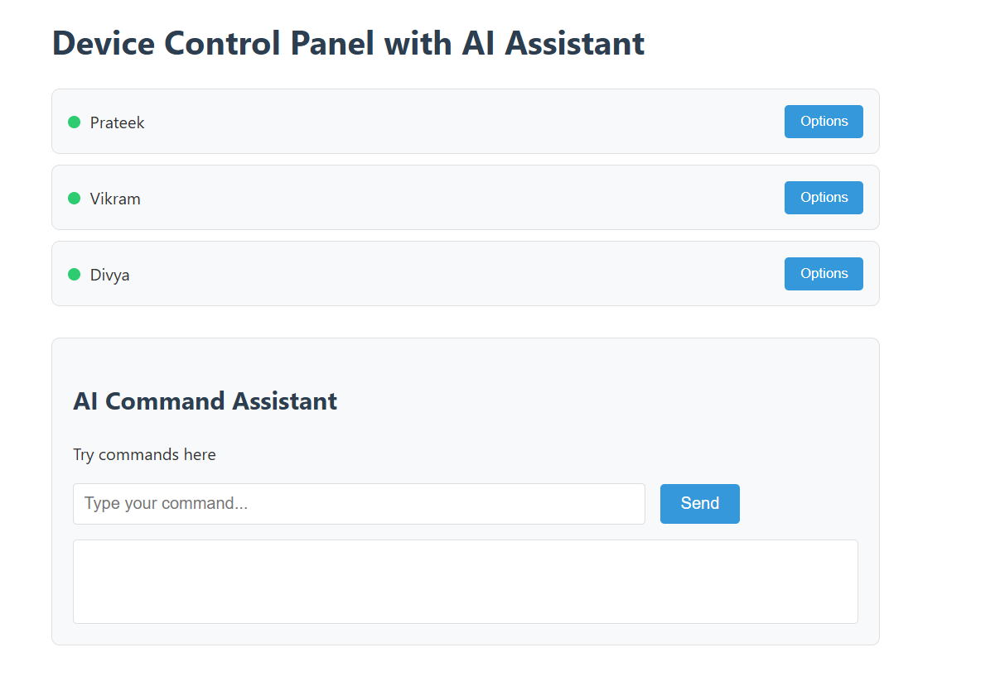

# Device Control Panel

A natural language interface for controlling devices (camera, mic, bluetooth, wifi) for specific users (Prateek, Vikram, Divya) through voice commands.

 *(Replace with actual screenshot)*

## Features

- **Natural Language Processing**: Control devices using everyday language
- **Multi-user Support**: Manage devices for Prateek, Vikram, and Divya
- **Device Control**: Toggle camera, microphone, bluetooth, and wifi status
- **Visual Feedback**: Real-time status indicators for each user
- **JSON API Integration**: Uses OpenRouter API for command interpretation

## Technologies Used

- HTML5, CSS3, JavaScript (ES6+)
- OpenRouter API (Mixtral 8x7B Instruct model)
- Responsive Web Design

## Setup Instructions

### Prerequisites

- Modern web browser (Chrome, Firefox, Edge)
- OpenRouter API key (get one at [openrouter.ai](https://openrouter.ai))

### Installation

1. Clone the repository:
   ```bash
   git clone https://github.com/yourusername/device-control-panel.git
   cd device-control-panel
